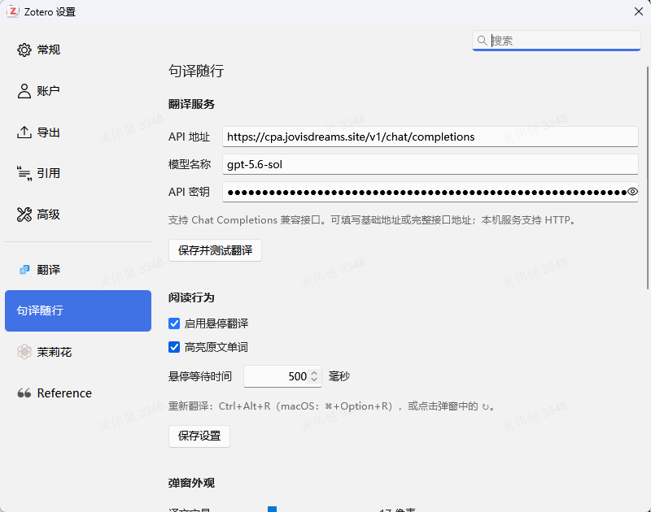
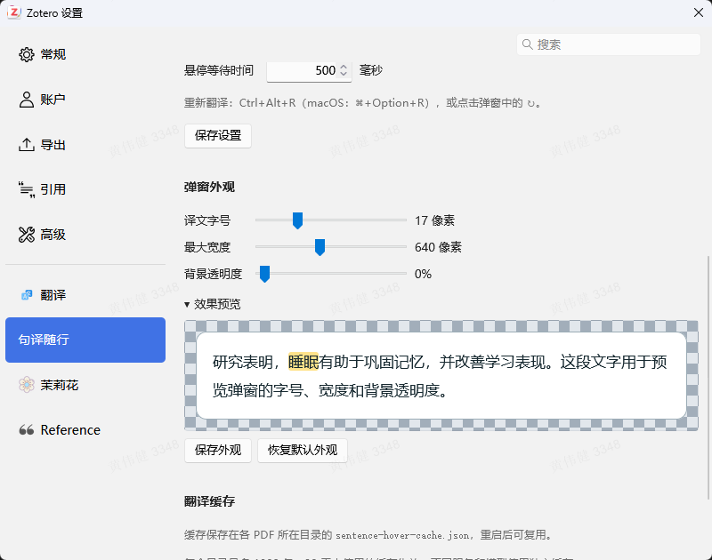

<div align="center">

# 句译随行 Sentence Hover

[](https://www.zotero.org/)
[](LICENSE)

在 Zotero 中阅读英文论文，鼠标悬停即可查看中文整句翻译，移动到不同单词时联动高亮对应译文。

</div>

## 1. 基础功能

- **悬停翻译**：自动识别鼠标所在的英文句子，无需划选。
- **中英联动高亮**：悬停英文词时，高亮中文译句中的对应词语；原文单词高亮可单独开关。


## 2. 安装与配置

### 2.1 安装插件

当前版本 **v1.0.1**，Zotero 版本要求为 **10.x**。

1. 从 [Releases](https://github.com/Nova-Meteor/zotero-sentence-hover/releases/latest) 下载插件安装文件 `sentence-hover-1.0.1.xpi`。
2. 打开 Zotero，进入 **工具 → 插件**。
3. 点击右上角齿轮，选择 **Install Plugin From File...**，选中该 XPI 文件。
4. 安装后重新打开 PDF；如果设置页未出现，可重启 Zotero。

### 2.2 配置翻译服务

打开 **编辑 → 设置 → 句译随行 → 翻译服务**，填写以下内容：

| 设置项 | 填写内容 |
| --- | --- |
| API 地址 | 服务商提供的基础地址，例如 `https://你的服务商地址/v1`；也可填写完整的 `https://你的服务商地址/v1/chat/completions` 地址 |
| 模型名称 | 服务商提供的模型 ID，例如 `gpt-5.6-sol` |
| API 密钥 | 对应服务的密钥 API |

点击 **保存并测试翻译**。测试进度和结果显示在按钮下方。



## 3. 使用教程

### 3.1 悬停翻译与单词高亮

打开一篇pdf论文，把鼠标停在单词上。默认等待 **500 毫秒**后触发整句翻译。

在同一句中移动鼠标，中文对应词语会随之高亮。原文单词也会显示临时黄色高亮，可通过 **设置 → 阅读行为 → 高亮原文单词** 关闭。该开关立即生效，关闭后仍保留中文联动高亮。


### 3.2 调整弹窗外观

进入 **设置 → 弹窗外观**，拖动滑块即可预览效果。

| 设置项 | 范围 | 默认值 |
| --- | --- | --- |
| 译文字号 | 12–32 像素 | 17 像素 |
| 最大宽度 | 240–1200 像素 | 640 像素 |
| 背景透明度 | 0–80% | 0%，不透明 |

点击 **保存外观**后立即应用。



### 3.3 重新翻译与关闭弹窗

| 操作 | 方法 |
| --- | --- |
| 重新翻译当前句子 | 点击弹窗右侧的 ↻，或按 **Ctrl+Alt+R**；macOS 使用 **⌘+Option+R** |
| 关闭弹窗 | 点击 ×、按 **Esc**，或滚动页面 |
| 复制译文 | 将鼠标移入弹窗，选择中文并复制 |

## 4. 开发

安装 Node.js 24 或更新版本，以及 Python 3，在仓库目录运行：

```bash
npm ci
npm test
python scripts/build.py
```

安装包和 SHA-256 校验文件生成在 `outputs/`。

| 文件 | 用途 |
| --- | --- |
| `addon.js` | 阅读器交互、翻译请求与弹窗 |
| `core.js` | 断句、单词定位与对应关系校验 |
| `cache.js` | 本地缓存 |
| `prefs.xhtml` / `prefs.js` / `prefs.css` | 设置页 |
| `tests/` | 缓存、翻译与模拟阅读器测试 |
